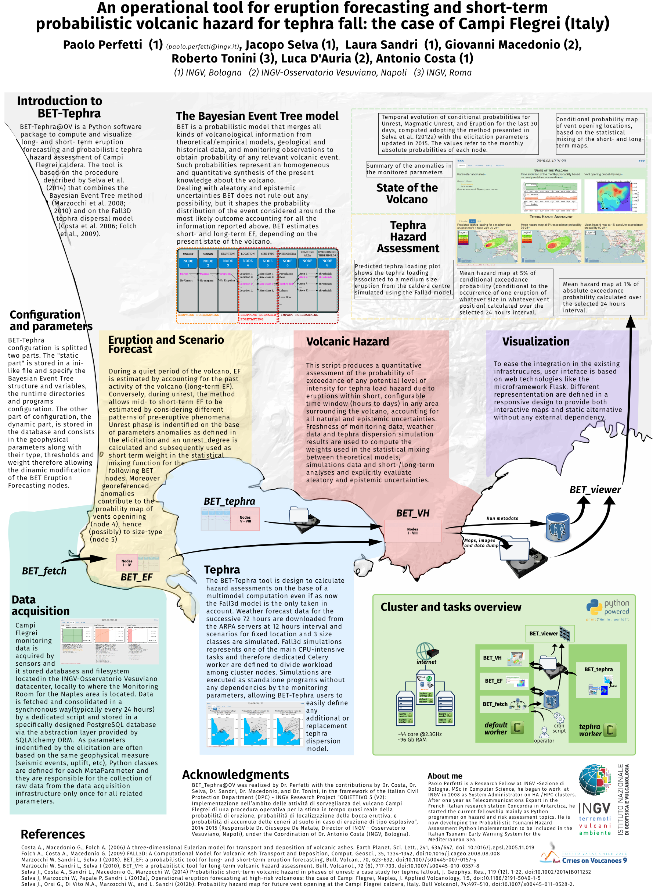
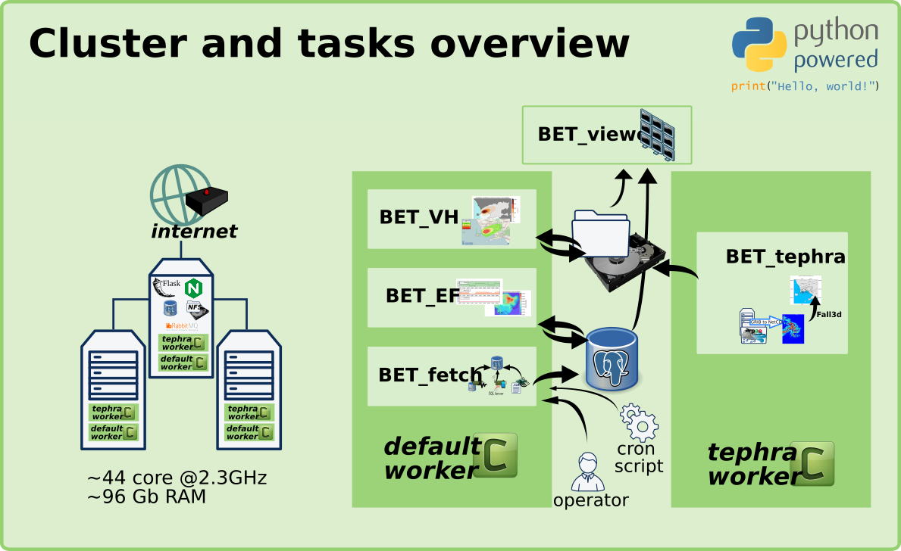

# BET-Tephra

## Introduction
BET-Tephra@OV is a Python software package to compute and visualize long- and short- term eruption forecasting and probabilistic tephra hazard assessment of Campi Flegrei caldera. The tool is based on the procedure described by Selva et al. (2014) that combines the Bayesian Event Tree method (Marzocchi et al. 2008; 2010) and on the Fall3D tephra dispersal model (Costa et al. 2006; Folch et al., 2009).

## The Bayesian Event Tree model
BET is a probabilistic model that merges all kinds of volcanological information from theoretical/empirical models, geological and historical data, and monitoring observations to obtain probability of any relevant volcanic event. Such probabilities represent an homogeneous and quantitative synthesis of the present knowledge about the volcano.
Dealing with aleatory and epistemic uncertainties BET does not rule out any possibility, but it shapes the probability distribution of the event considered around the most likely outcome accounting for all the information reported above. BET estimates short- and long-term EF, depending on the present state of the volcano.




## Acknowledgments
BET_Tephra@OV was realized by Dr. Perfetti with the contributions by Dr. Costa, Dr. Selva, Dr. Sandri, Dr. Macedonio, and Dr. Tonini, in the framework of the Italian Civil Protection Department (DPC) - INGV Research Project “OBIETTIVO 5 (V2): Implementazione nell’ambito delle attività di sorveglianza del vulcano Campi Flegrei di una procedura operativa per la stima in tempo quasi reale della probabilità di eruzione, probabilità di localizzazione della bocca eruttiva, e probabilità di accumulo delle ceneri al suolo in caso di eruzione di tipo esplosivo”, 2014-2015 (Responsible Dr. Giuseppe De Natale, Director of INGV - Osservatorio Vesuviano, Napoli), under the Coordination of Dr. Antonio Costa (INGV, Bologna).

## References
- Costa A., Macedonio G., Folch A. (2006) A three-dimensional Eulerian model for transport and deposition of volcanic ashes. Earth Planet. Sci. Lett., 241, 634/647, doi: 10.1016/j.epsl.2005.11.019
- Folch A., Costa A., Macedonio G. (2009) FALL3D: A Computational Model for Volcanic Ash Transport and Deposition, Comput. Geosci., 35, 1334-1342, doi:10.1016/j.cageo.2008.08.008
- Marzocchi W, Sandri L, Selva J (2008). BET_EF: a probabilistic tool for long- and short-term eruption forecasting, Bull. Volcan., 70, 623-632, doi:10.1007/s00445-007-0157-y
- Marzocchi W, Sandri L, Selva J (2010), BET_VH: a probabilistic tool for long-term volcanic hazard assessment, Bull. Volcanol., 72 (6), 717-733, doi:10.1007/s00445-010-0357-8
- Selva J., Costa A., Sandri L., Macedonio G., Marzocchi W. (2014) Probabilistic short-term volcanic hazard in phases of unrest: a case study for tephra fallout, J. Geophys. Res., 119 (12), 1-22, doi:10.1002/2014JB011252
- Selva J, Marzocchi W, Papale P, Sandri L (2012a), Operational eruption forecasting at high-risk volcanoes: the case of Campi Flegrei, Naples, J. Applied Volcanology, 1:5, doi:10.1186/2191-5040-1-5
- Selva J., Orsi G., Di Vito M.A., Marzocchi W., and L. Sandri (2012b). Probability hazard map for future vent opening at the Campi Flegrei caldera, Italy. Bull Volcanol, 74:497–510, doi:10.1007/s00445-011-0528-2.


## Install on Debian 8 (Jessie)



### Basic dependencies
```
sudo apt-get install build-essential git virtualenvwrapper
        libmysqlclient-dev python-dev libpq-dev freetds-dev  \
        netcdf-bin libnetcdf-dev libhdf5-dev ntp libblas-dev \
        liblapack-dev gfortran python-redis libffi-dev gdal-bin
```

### Matplotlib/basemap dependencies
```
sudo apt-get install libfreetype6-dev libpng12-dev \
        libgeos++-dev libgeos-dev
```

### FALL3D dependencies
```
sudo apt-get install mpich2 mpich2-doc libmpich2-dev ncl-ncarg
```

### Fall3d2GMT dependencies
```
sudo apt-get install gmt imagemagick ghoscript
```

### Basemap/GDAL
```
LC_ALL=C pip install basemap --allow-external basemap --allow-unverified basemap
pip install GDAL==1.10.0 --global-option=build_ext --global-option="-I/usr/include/gdal"
```

### NetCDF
```
USE_SETUPCFG=0 HDF5_INCDIR=/usr/include/hdf5/serial HDF5_LIBDIR=/usr/lib/x86_64-linux-gnu/hdf5/serial pip install netCDF4
```
### Supervisord
```
sudo apt-get install supervisor
```

### Messagging services
Only on master server (`ceneri`):
```
apt-get install rabbitmq-server redis-server
```

### Examples and snippets  

#### Load NetCDF file
```python
from netCDF4 import Dataset

rootgrp = Dataset("examples/CFH-2015101500-1.res.nc", "r", format="NETCDF3_64BIT")
# Caso fall3d, ci sono solo 2 frame e leggo il secondo
rootgrp['LOAD'][1]
```

#### Celery: create coordinator's tasks
 ```python
  from bet.messaging.celery.tasks import add, run_demo_model, build_input_params
  from celery import chain
  (build_input_params.s("etc/bet.cfg") | run_demo_model.s())().get()

  chain(get_conf("etc/bet.cfg"),
  mod_bet = glob(os.path.join("bet","*","*.py"))
  CELERY_IMPORTS=tuple([x.replace("/",".").replace(".__init__.py","").replace(".py","") for x in mod_bet]
```

#### Celery: start workers
```bash
  celery -A bet.messaging.celery.tasks worker --loglevel=info
  celery -A bet.messaging.celery.tasks worker -Q matlab_jobs --loglevel=info --hostname=w_matlab@%h
  celery -A bet.messaging.celery.tasks worker -Q master_jobs --loglevel=info --hostname=w_master@%h
  celery -A bet.messaging.celery.tasks worker -Q default --loglevel=info --hostname=w_default@%h
```


## More infos
### Matlab links
See https://it.mathworks.com/help/matlab/matlab-engine-for-python.html   
Install official wrapper https://it.mathworks.com/help/matlab/matlab_external/install-the-matlab-engine-for-python.html


### Dev webhook   
See https://github.com/adnanh/webhook/   
Dependencies: ```sudo apt-get install golang```


### Autoreloading for Celery
http://docs.celeryproject.org/en/latest/userguide/workers.html#autoreloading
Dependencies: ```pip install pyinotify```


### Supervisor configuration example
```
 [program:celery_bet]
 command=/home/paolo/.virtualenvs/bet/bin/celery --autoreload -A bet.messaging.celery.tasks worker -Q default --loglevel=info
 directory=/opt/bet
 user=paolo
 numprocs=1
 stdout_logfile=/opt/bet/logs/celeryd.log
 stderr_logfile=/opt/bet/logs/celeryd.log
 autostart=true
 autorestart=true
 startsecs=10
 stopwaitsecs=600
 # environment = DJANGO_SETTINGS_MODULE=myapp.settings.prod
```
If a configuration example is modified, `supervisord` needs to be reloaded
```
supervisorctl reread
supervisorctl update
```

### RabbitMQ fresh configuration
```
rabbitmqctl stop_app
rabbitmqctl reset
rabbitmqctl start_app

rabbitmqctl add_vhost bet_vhost
rabbitmqctl add_vhost bet_dev_vhost

rabbitmqctl add_user bet_user pass
rabbitmqctl add_user bet_dev_user pass

rabbitmqctl set_permissions -p bet_vhost bet_user '.*' '.*' '.*'
rabbitmqctl set_permissions -p bet_dev_vhost bet_dev_user '.*' '.*' '.*'
```
